# CAD-CDSS

**관상동맥질환(CAD) 위험도 예측 임상의사결정 지원 시스템**

CAG(관상동맥조영술) 시행 전에 확보 가능한 임상정보만으로 CAD 고위험 환자를 선별하고,
그 예측 근거를 의료진이 확인할 수 있는 형태로 함께 제시하는 CDSS 프로토타입입니다.

🔗 **라이브 데모** — https://cad-cdss-jotd3fv7fxmv5sv2epac9u.streamlit.app/

> ⚠️ 공개 데이터셋 기반의 **연구·교육용 프로토타입**이며 실제 진단·처방 결정을 대체하지 않습니다.

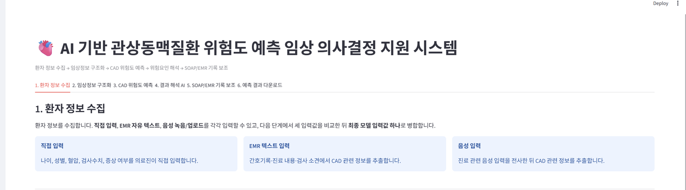

---

## 이 프로젝트가 다루는 문제

예측 확률만 보여주는 모델은 임상에서 쓰이지 않습니다. 의료진에게는 세 가지가 함께 필요합니다.

1. **지금 확보된 정보만으로** 판단할 수 있는가 — 53개 변수가 한 번에 모이는 경우는 없습니다
2. **왜 이 결과인가** — 근거 없는 확률은 검증할 수 없습니다
3. **기록까지 이어지는가** — 결과를 따로 옮겨 적어야 한다면 실제로는 쓰이지 않습니다

그래서 이 시스템은 모델 성능 경쟁이 아니라 **임상 workflow 설계**에 초점을 맞췄습니다.

```
① 환자 정보 수집 → ② 임상정보 구조화 → ③ CAD 위험도 예측
                                    → ④ 결과 해석 AI → ⑤ SOAP/EMR 기록 보조
```

각 탭은 기술 스택이 아니라 **실제 진료 흐름 순서**로 배치했습니다.

---

## 주요 기능

### ① 세 가지 입력 경로

| 방식 | 설명 |
|---|---|
| 직접 입력 | 53개 변수를 임상정보 확보 순서(문진 → 혈액검사 → ECG → ECHO)로 입력 |
| EMR 자유텍스트 | 간호기록·진료메모를 그대로 붙여넣으면 NLP가 표준 변수로 변환 |
| 음성 입력 | Whisper 전사 후 동일한 NLP 파이프라인 통과 |

세 경로의 결과는 **하나의 확정 입력값으로 병합**되며, 값이 충돌하면 비교표에서 확인·수정할 수 있습니다.
우선순위는 **직접 입력 > EMR 추출 > 음성 추출** 입니다. 의료진이 명시적으로 입력한 값이 자동 매칭 결과보다 우선합니다.

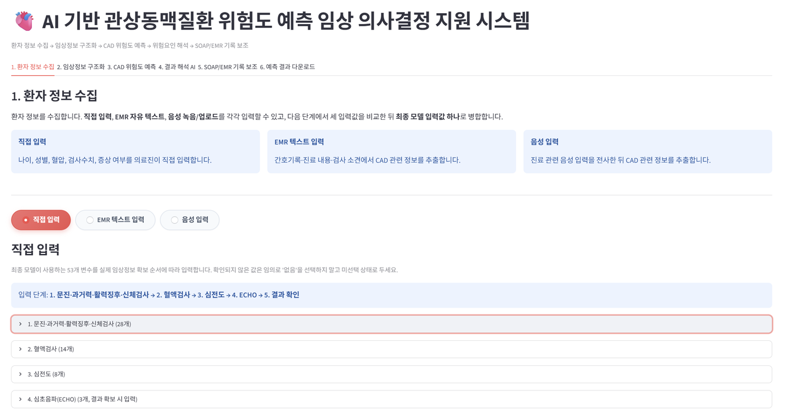

53개 변수는 실제 임상정보 확보 순서에 따라 **문진·과거력·활력징후(28) → 혈액검사(14) → 심전도(8) → 심초음파(3)** 로 나누어 입력합니다.

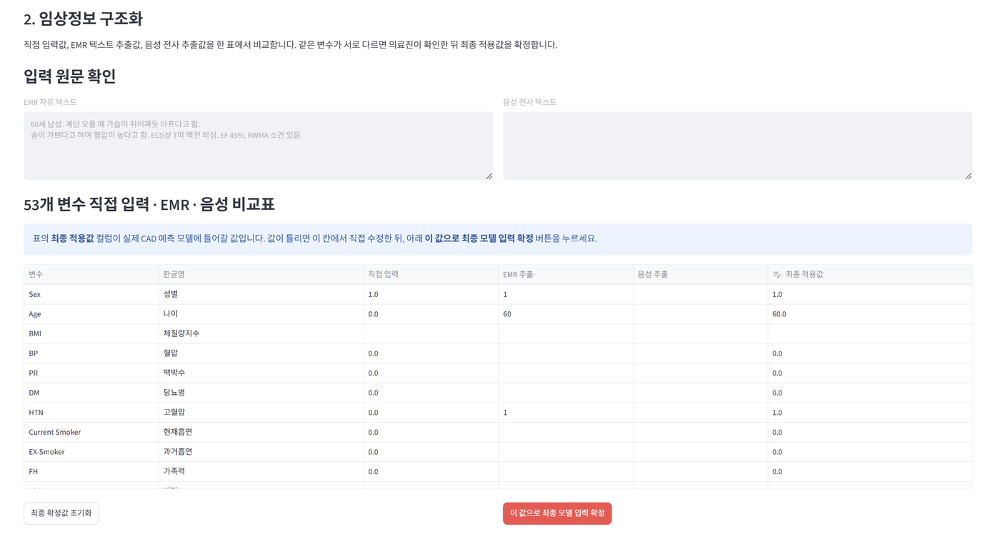

세 경로의 값을 한 표에서 비교하고, **최종 적용값** 열에서 직접 수정한 뒤 확정합니다.

### ② 2단계 임상 NLP

1. **정규식 + 의료용어 사전** — 나이·혈압 등 수치와 표준 표현 추출 (주변에 '없음/부인'이 있으면 제외)
2. **문자 n-gram 의미 유사도 매칭** — 사전에 없는 자연어 표현을 표준 변수에 연결

> `"가슴이 쥐어짜듯 아프다"` → Typical Chest Pain
> `"숨이 가쁘다"` → Dyspnea

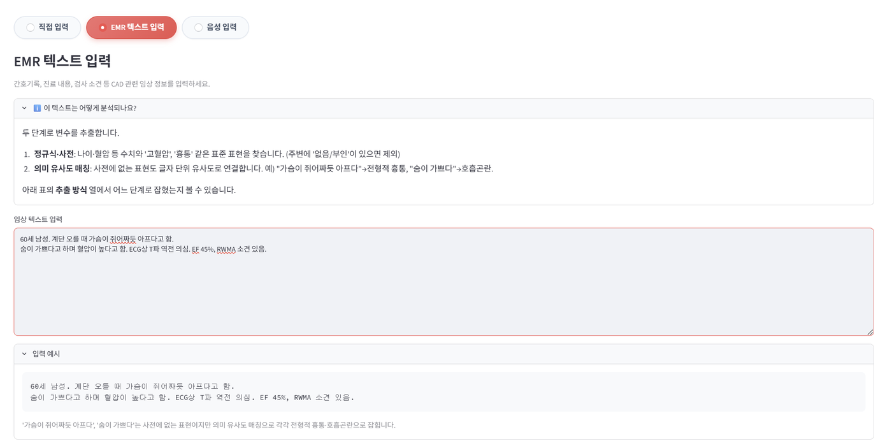

화면에 **추출 방식**(정규식·사전 / 유사도 매칭)을 함께 노출해 의료진이 자동 매칭 결과를 검증할 수 있게 했습니다.

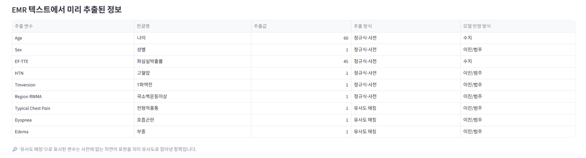

### ③ 결측 처리의 투명성

미입력 연속형 변수는 학습 데이터 중앙값으로 대체하되, **대체되었다는 사실을 숨기지 않습니다.**

- 입력 완성도(예: 45/53 = 84.9%)를 예측 결과와 나란히 표시
- 미입력 항목을 변수군별로 나열
- 완성도 80% 미만이면 결과의 불확실성이 커질 수 있다고 경고

**미입력과 '없음(0)'은 다릅니다.** 이진형의 0은 의료진이 선택한 '없음'이므로 유효한 입력으로 처리하고,
연속형의 0은 미입력으로 보아 중앙값 대체 대상으로 넘깁니다.

| 완성도 100% | 완성도 45.3% |
|---|---|
| 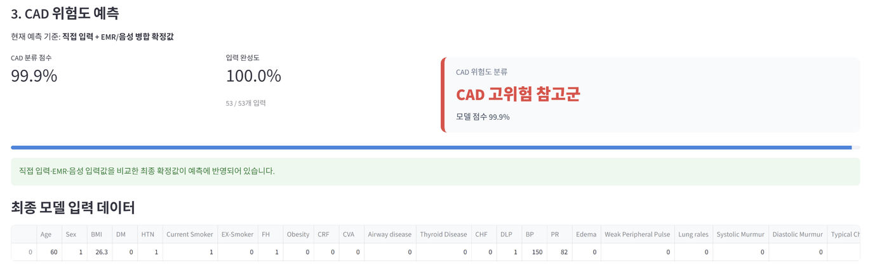 | 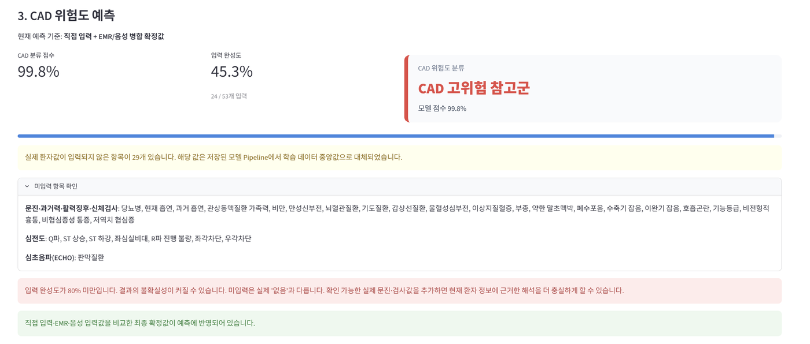 |

같은 환자라도 확보된 정보량에 따라 **결과를 신뢰할 수 있는 조건인지**를 함께 표시합니다.
오른쪽은 24/53만 입력된 상태로, 미입력 29개 항목과 중앙값 대체 사실을 명시하고 80% 미만 경고를 띄웁니다.

### ④ 설명가능성 (SHAP)

개별 환자의 예측에 기여한 상위 변수를 방향(위험도 증가/감소)과 함께 제시합니다.
SHAP 계산이 실패하면 GradientBoosting의 `feature_importances_`로 자동 폴백합니다.

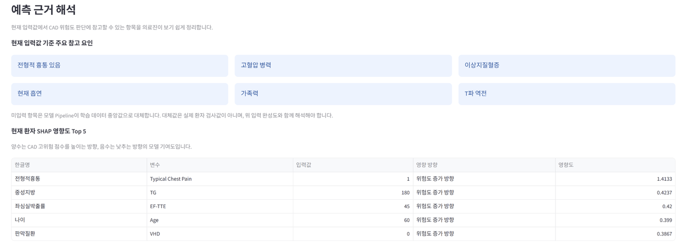

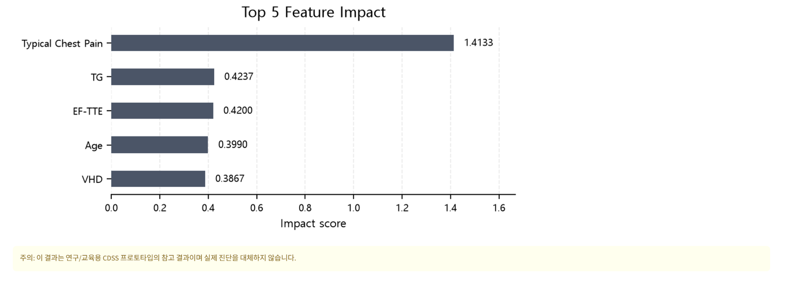

### ⑤ 진료지침 RAG

LLM이 자유롭게 생성한 임상 설명은 근거를 확인할 수 없어 임상에서 쓸 수 없습니다.
진료지침 6종을 임베딩·검색해 근거를 먼저 찾고, LLM이 **그 근거를 인용해** 답변하도록 구성했습니다.

- 1순위: OpenAI `text-embedding-3-small`
- 폴백: TF-IDF (임베딩 호출 실패 시에도 근거 검색이 계속 동작)

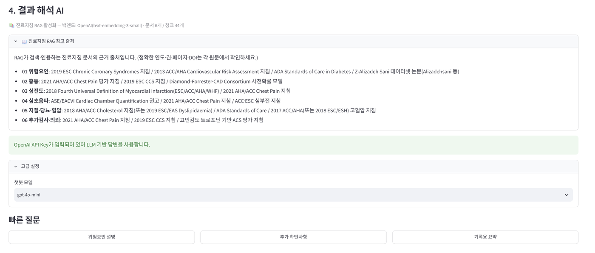

답변 끝에 실제 인용 문서를 표기해 근거를 추적할 수 있습니다.

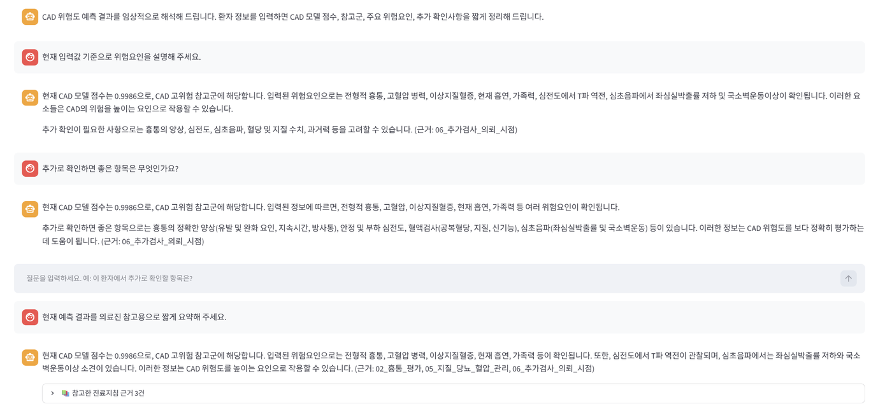

### ⑥ SOAP / EMR 기록 보조

예측 결과와 임상 텍스트로 SOAP 초안을 생성하고, **복사·붙여넣기 없이 EMR 입력 필드에 자동 반영**합니다.

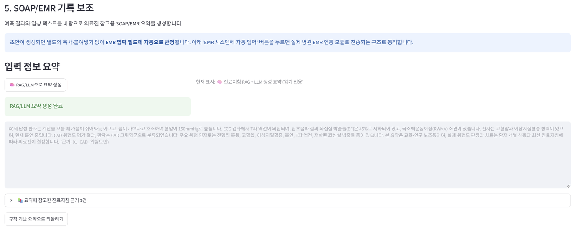

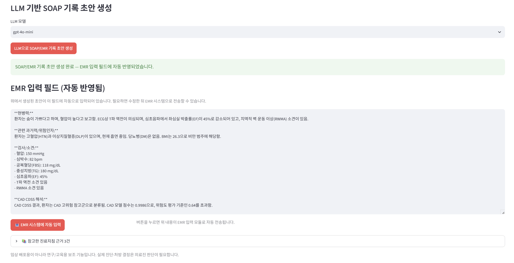

예측 이력은 세션에 저장하고 CSV로 내려받을 수 있습니다. 모델명·임계값·입력 완성도·미입력 항목이 함께 기록됩니다.

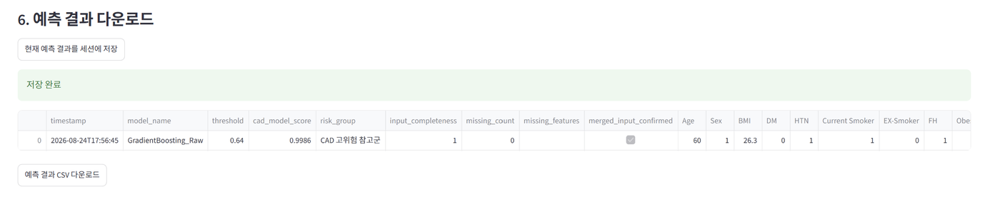

---

## 데이터와 모델

### 데이터

- **Z-Alizadeh Sani dataset** (공개 CAD 데이터셋) — 303명 · 53개 임상 변수
- Train 242 / Test 61 (test: Normal 18, CAD 43)
- 라이선스 문제로 원본 파일은 저장소에 포함하지 않았습니다 (아래 *재현 방법* 참조)

### 검사 단계별 변수군 설계

53개 변수를 실제 임상정보 확보 순서로 나누고, **검사가 추가될 때의 효과를 직접 검정**했습니다.

| 변수군 | n | 내용 | OOF ROC-AUC |
|---|---:|---|---:|
| **A** | 28 | 문진 · 과거력 · 활력징후 · 신체검사 | 0.9092 |
| **A+B** | 50 | + 혈액검사 · ECG | 0.9185 |
| **A+B+C** | 53 | + ECHO (EF-TTE, Region RWMA, VHD) | **0.9344** |

Repeated CV + paired bootstrap 5,000회로 추가 효과를 검정한 결과:

| 비교 | ΔROC-AUC | 95% CI | 판정 |
|---|---:|---|---|
| A → A+B (검사·ECG 추가) | +0.0093 | −0.0071 ~ +0.0264 | 개선 경향이나 **불확실** |
| A+B → A+B+C (ECHO 추가) | **+0.0159** | **+0.0051 ~ +0.0281** | **통계적으로 명확한 개선** |

ECHO 추가는 Brier score도 −0.0076 (95% CI −0.0122 ~ −0.0030)로 유의하게 개선했습니다.
즉 **혈액검사·ECG 추가만으로는 명확한 이득이 확인되지 않았고, ECHO 단계에서 분명한 개선**이 나타났습니다.

### 모델 선택

14개 후보(LogisticRegression / RandomForest / ExtraTrees / GradientBoosting / SVM × class_weight·SMOTE·ROS)를
repeated CV로 비교했습니다. 상위 2개는 다음과 같습니다.

| 순위 | 모델 | OOF ROC-AUC | OOF Brier |
|---:|---|---:|---:|
| 1 | RandomForest_ROS | 0.9344 | 0.1071 |
| 3 | GradientBoosting_Raw | 0.9319 | **0.0948** |

두 모델의 차이를 paired bootstrap으로 검정한 결과 **ROC-AUC·PR-AUC·Brier 모두 통계적으로 명확한 차이가 없었습니다**
(ΔROC-AUC +0.0025, 95% CI −0.0112 ~ +0.0161).

성능이 동등하다면 **확률의 신뢰성**이 더 나은 쪽을 택하는 것이 임상적으로 타당하다고 판단해
calibration이 우수한 **GradientBoosting_Raw**를 최종 모델로 선택했습니다.

| 보정 방법 | Brier | ECE | Calibration slope |
|---|---:|---:|---:|
| **Raw (선택)** | **0.0948** | **0.0425** | 0.828 |
| Isotonic | 0.0951 | 0.0398 | 1.278 |
| Sigmoid | 0.0990 | 0.0666 | 1.628 |

### 임계값

**0.64** — Test set이 아니라 **training set의 repeated OOF 예측**에서 선택했습니다.
선별 보조 도구라는 성격상 `recall ≥ 0.90`을 먼저 만족시킨 뒤 specificity를 최대화하는 규칙을 적용했습니다.

> Training OOF 기준: recall 0.902 · specificity 0.797 · F1 0.910

### 최종 성능 (고정 Test set 1회 평가, n = 61)

| 지표 | 값 | 95% CI |
|---|---:|---|
| ROC-AUC | 0.815 | 0.682 ~ 0.927 |
| PR-AUC | 0.911 | 0.823 ~ 0.976 |
| Recall (민감도) | 0.860 | 0.750 ~ 0.955 |
| Specificity | 0.667 | 0.438 ~ 0.880 |
| Precision | 0.860 | 0.750 ~ 0.955 |
| F1 | 0.860 | 0.771 ~ 0.932 |
| Accuracy | 0.803 | 0.705 ~ 0.902 |
| Brier | 0.158 | 0.091 ~ 0.233 |

신뢰구간은 **patient-level percentile bootstrap 5,000회** 기준입니다.

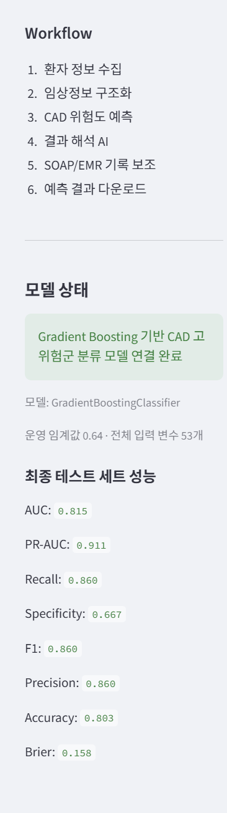

앱 사이드바는 성능 수치를 하드코딩하지 않고 `gradient_boosting_final_metadata.json`에서 읽어옵니다.
재학습 후 실제 모델과 표시 수치가 어긋나는 것을 막기 위한 구조입니다.

> **CV 성능(0.934)과 Test 성능(0.815)의 차이에 주의해야 합니다.**
> 앞의 변수군·모델 비교는 training set 내부 repeated CV 결과이며,
> 위 표만이 학습에 전혀 쓰이지 않은 데이터에서의 성능입니다.
> **n = 61로 표본이 작아 신뢰구간이 넓습니다.** 점추정치보다 구간을 함께 봐야 합니다.

---

## 실행 방법

```bash
git clone https://github.com/sojeong8282/cad-cdss.git
cd cad-cdss
pip install -r requirements.txt
streamlit run app.py
```

### API Key 설정

LLM 기능(음성 전사 · RAG 답변 · SOAP 생성)은 `OPENAI_API_KEY`가 있을 때만 활성화됩니다.
**키가 없어도 예측 · SHAP · TF-IDF 기반 RAG 검색은 그대로 동작합니다.**

키는 코드에 포함하지 않고 아래 두 경로로 주입합니다.

**로컬** — 프로젝트 루트에 `.env` 생성

```
OPENAI_API_KEY=sk-...
```

**Streamlit Cloud** — Settings → Secrets

```toml
OPENAI_API_KEY = "sk-..."
```

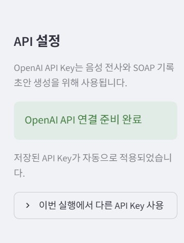

### 재현 방법 (전체 분석 파이프라인)

원본 데이터셋을 프로젝트 루트에 `Z-Alizadeh sani dataset.xlsx` 이름으로 두고 실행합니다.

```bash
python cad_model_analysis_final.py
```

전처리 → 14개 모델 비교 → A/B/C 변수군 검정 → calibration 비교 → 임계값 선택 → 최종 test 평가까지
전 과정이 `cad_cdss_final_outputs/`에 저장됩니다.

---

## 저장소 구성

```
app.py                        Streamlit CDSS 앱 (6개 탭 워크플로)
cad_model_service.py          최종 모델 로딩 · 입력 검증 · 예측 서비스
cad_model_analysis_final.py   전체 분석 파이프라인 (재현용)
cad_rag.py                    진료지침 RAG 검색기 (OpenAI 임베딩 / TF-IDF 폴백)
requirements.txt
guidelines/                   진료지침 문서 6종
cad_cdss_final_outputs/       최종 모델 · 성능 · 신뢰구간 · 변수군 분석 결과
docs/screenshots/             앱 화면 캡처
```

### 주요 결과 파일

| 파일 | 내용 |
|---|---|
| `gradient_boosting_final_metadata.json` | 최종 모델 정보 · 변수 목록 · test 성능 |
| `gradient_boosting_final_test_confidence_intervals.csv` | 전 지표 95% CI |
| `abc_paired_bootstrap_differences.csv` | A/B/C 변수군 추가 효과 검정 |
| `candidate_model_repeated_cv_summary.csv` | 14개 모델 비교 |
| `gradient_boosting_calibration_summary.csv` | Raw / Isotonic / Sigmoid 비교 |
| `gradient_boosting_threshold_selection.png` | 임계값 선택 근거 |

---

## 기술 스택

| 영역 | 사용 기술 |
|---|---|
| ML · 분석 | scikit-learn (Pipeline, GradientBoosting), imbalanced-learn (SMOTE/ROS), statsmodels (VIF) |
| 설명가능성 | SHAP (TreeExplainer) |
| NLP · 검색 | 정규식 + 의료용어 사전, 문자 n-gram TF-IDF 유사도, RAG |
| LLM · 음성 | OpenAI Chat (gpt-4o-mini), Whisper |
| 앱 | Streamlit, pandas, numpy, joblib, matplotlib |

전처리 누수를 막기 위해 scaling · imputation · SMOTE를 모두 **Pipeline 내부**에 배치해
교차검증 fold마다 재적합되도록 구성했습니다.

---

## 한계

1. **303명 규모의 단일 공개 데이터셋**입니다. Test set이 61명으로 작아 신뢰구간이 넓습니다.
2. **외부 기관 검증이 없습니다.** 다른 병원·인구집단으로 일반화할 수 없습니다.
3. 데이터가 특정 시기·기관에서 수집되어 **selection bias** 가능성이 있습니다.
4. 의미 유사도 매칭은 문자 n-gram 기반이라 **false positive가 발생할 수 있습니다.**
   화면에 추출 방식을 노출해 의료진이 검증하도록 설계했지만, 자동 추출을 그대로 신뢰해서는 안 됩니다.
5. LLM 생성 결과는 RAG 근거를 인용하도록 제약했으나 **환각을 완전히 제거하지는 못합니다.**
6. **CDSS로서의 임상 효용(의사결정 개선 여부)은 평가되지 않았습니다.** 예측 성능만 평가했습니다.

## 향후 과제

- 외부 기관 데이터 기반 재학습 및 검증
- 의미 유사도 매칭의 정밀도 개선 (임상 도메인 임베딩 활용)
- 실제 EMR 연동 및 사용성 평가
- 변수군 A만으로 선별 → 고위험군만 추가 검사로 넘기는 단계적 운용 시나리오 검증

---

## Disclaimer

본 시스템은 연구·교육 목적의 프로토타입입니다.
실제 진단·처방 결정은 의료진 판단과 CAG 등 확진 검사 결과를 함께 고려해야 합니다.
임상 배포를 위해서는 institutional 데이터 기반 재학습, 외부 검증, 규제 검토가 별도로 필요합니다.
